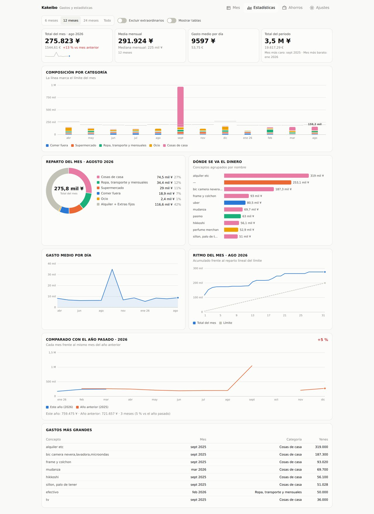
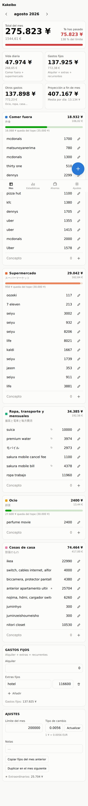
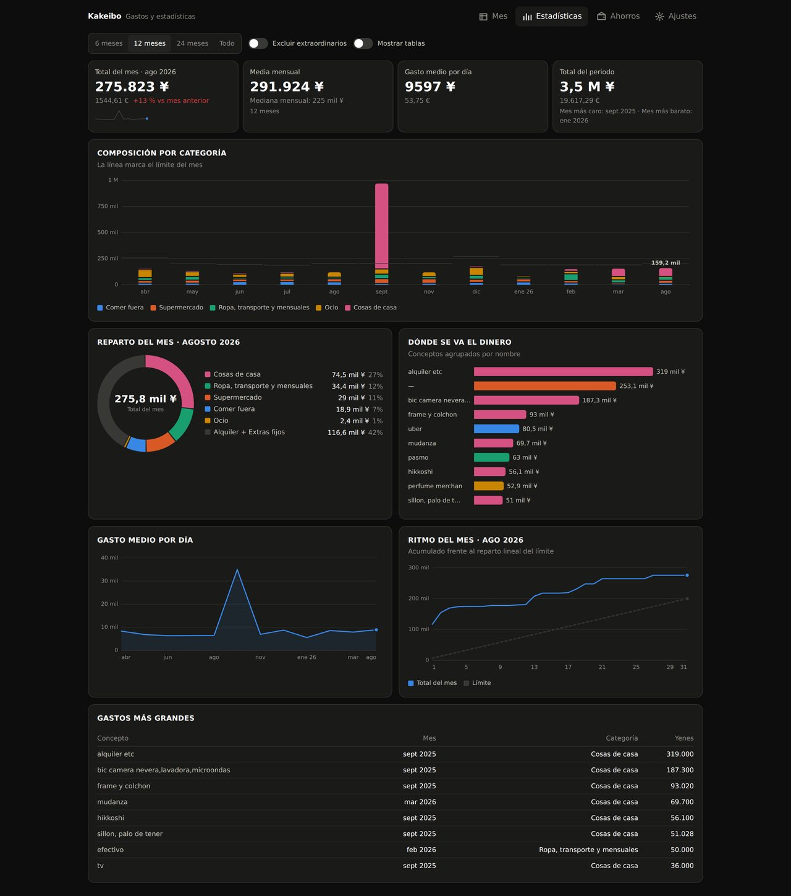

# Kakeibo · control de gastos

Sustituto del Excel de gastos mensuales, con un apartado de estadísticas.
Es una aplicación web estática: **no hay servidor ni base de datos**, los datos
viven en el navegador del dispositivo, así que se puede alojar gratis para
siempre en GitHub Pages.

- Una pestaña por **mes**: cinco categorías editables, importes en yenes y en la
  moneda secundaria, alquiler, extras fijos, límite y balance — las mismas
  cuentas que hacía el Excel.
- Un apartado de **estadísticas**: evolución mensual, composición por categoría,
  ranking de conceptos y gasto medio por día del periodo elegido (6/12/24
  meses o todo), más un **mes en foco** con su propia navegación (reparto,
  ritmo del mes y gastos más grandes de ese mes en concreto).
- **Ahorros**: fotos del patrimonio por fechas, con deudas y varias divisas, y
  una **previsión de ahorro** a 3/6/12 meses a partir de tus ingresos previstos
  (Ajustes), en tres escenarios: gastando hasta el límite total, gastando
  hasta el tope de cada categoría (las que no tienen tope cuentan como gasto
  cero), o a tu ritmo real reciente. El mismo cálculo aparece también como
  indicador en cada mes.
- **Importador del Excel original**: lee las hojas con las cabeceras japonesas
  (外食, スーパーマーケット, 服装と電車と毎月費消, 娯楽, 部屋のもの) y las
  convierte en meses de la aplicación.
- **Topes por categoría** además del límite del mes, con su aviso al pasarse.
- **Borrar una categoría no borra su historial**: si tiene apuntes, se mueven a
  "Otros" (se crea sola si no existe) en vez de desaparecer, así que siguen
  contando en Mes y Estadísticas.
- **Apuntes sin coste** para dejar constancia de algo sin que afecte a las
  cuentas (un regalo dado o recibido, por ejemplo): se ven en el mes y en
  estadísticas, pero no suman al total ni al límite.
- **Fijos automáticos**: al abrir un mes nuevo hereda alquiler, extras y gastos
  recurrentes del anterior. Para el primer mes (o cuando no hay uno anterior),
  Ajustes → Valores por defecto deja definir también una plantilla de facturas
  fijas (agua, luz...), además del alquiler.
- **Deuda automática por sobregasto** (apagado por defecto, en Ajustes →
  Automatismos): al abrir el mes siguiente, si el anterior cerró por encima
  de su límite, apunta la diferencia como deuda en Ahorros — en tu última
  foto, o en una nueva, a elegir. Solo mira hacia delante: no toca meses que
  ya estuvieran pasados de límite antes de encenderlo.
- **Tipo de cambio** al día desde el Banco Central Europeo, o a mano.
- **Sincronización opcional** entre móvil y PC con Supabase (plan gratuito).
- **Vínculo de pareja opcional**: dos cuentas separadas se pueden vincular
  para verse los datos la una a la otra en solo lectura, con un selector Yo /
  Pareja / Juntos en Estadísticas y Ahorros — sin fusionar nunca los
  documentos ni poder editar los datos del otro.
- Funciona **sin conexión** (PWA instalable) y se ve bien en móvil y en PC.
- Interfaz en español, japonés e inglés.



<p>
  
  
</p>

## Poner en marcha

```bash
npm install
npm run dev      # http://localhost:5173
```

Otros comandos:

| Comando | Qué hace |
| --- | --- |
| `npm run build` | Build de producción en `dist/` |
| `npm run preview` | Sirve el build para comprobarlo |
| `npm test` | Tests (vitest) |
| `npm run coverage` | Tests + informe de cobertura |
| `npm run lint` | ESLint |
| `npx tsc -b` | Comprobación de tipos |

## Publicar gratis en GitHub Pages

1. Crea un repositorio en GitHub y sube este proyecto:

   ```bash
   git remote add origin git@github.com:USUARIO/kakeibo.git
   git push -u origin main
   ```

2. En **Settings → Pages → Build and deployment**, elige **GitHub Actions**
   como origen (`Source: GitHub Actions`). No hay que crear ninguna rama
   `gh-pages`.

3. Cada `push` a `main` ejecuta `.github/workflows/deploy.yml`: instala, pasa
   los tests y, solo si pasan, publica. La aplicación queda en
   `https://USUARIO.github.io/kakeibo/`.

El workflow calcula la ruta base sola: si el repositorio se llama
`USUARIO.github.io`, o si añades un fichero `public/CNAME` con tu dominio, la
base pasa a ser `/`.

`.github/workflows/ci.yml` se ejecuta en todas las ramas y en cada pull request
(lint, tipos, tests con cobertura y build), y guarda el build y la cobertura
como artefactos.

### Otras opciones gratuitas

Al ser un sitio estático vale cualquier hosting: Cloudflare Pages, Netlify o
Vercel funcionan subiendo `dist/` (comando de build `npm run build`, carpeta
`dist`). En esos casos deja `VITE_BASE` sin definir, porque la app se sirve en
la raíz.

## Dónde se guardan los datos

Primero, siempre, en el navegador del dispositivo (`localStorage`, clave
`kakeibo:data:v1`), con guardado automático 250 ms después de dejar de escribir
y otro al cerrar la pestaña o cambiar de app. No hay botón de guardar.

Eso hace que la app funcione sin cobertura, pero también que cada dispositivo
tenga su copia. Hay dos formas de juntarlas:

- **A mano**: Ajustes → *Exportar datos* descarga un `.json` con todo, e
  *Importar datos* lo restaura en el otro dispositivo. Es también la copia de
  seguridad recomendada. Ojo: *Importar datos* **reemplaza** lo que haya en ese
  dispositivo, mientras que *Importar Excel* deja elegir mes a mes. Si ese
  dispositivo sincroniza, la copia importada también se marca como la más
  reciente para el próximo `Sincronizar`, así que gana el pulso frente a la
  nube en vez de deshacerse sola justo después de importar.
- **Automática**: la sincronización con Supabase que se describe abajo.

## Sincronizar el móvil y el PC (Supabase, plan gratuito)

1. Crea un proyecto en [supabase.com](https://supabase.com) (plan Free).
2. En **SQL Editor**, pega y ejecuta [`supabase/schema.sql`](supabase/schema.sql).
   Crea la tabla `kakeibo_docs` con RLS: cada usuario solo puede leer y escribir
   su propia fila.
3. En **Project Settings → API**, copia la *Project URL* y la clave *anon*.
4. En **Authentication → URL Configuration**, añade la dirección de la app
   (`https://USUARIO.github.io/kakeibo/`) a *Site URL* y a *Redirect URLs*. El
   acceso ya no usa enlaces para entrar, pero Supabase sigue mandando un
   correo de confirmación al crear la cuenta (si tienes *Confirm email*
   activado), y ese correo sí lleva un enlace; sin este paso apunta a
   `localhost` y da "página no encontrada".
5. En la app: **Ajustes → Sincronización**, pega URL y clave, escribe tu correo
   y una contraseña, y pulsa *Crear cuenta*. En el otro dispositivo, pega la
   misma URL y clave, escribe el mismo correo y contraseña, y pulsa *Entrar*.

El acceso del día a día es con correo y contraseña normales — sin enlaces ni
códigos de por medio — así que funciona igual en cualquier navegador o
dispositivo, incluido un icono que hayas añadido a la pantalla de inicio del
móvil (esos iconos "instalados" no comparten sesión con el navegador normal;
con contraseña no hace falta que la compartan, porque entras directamente
dentro de cada uno).

Si en **Authentication → Providers → Email** tienes activado *Confirm email*
(viene así por defecto en los proyectos nuevos), tras *Crear cuenta* llega un
correo de confirmación: ábrelo una vez y vuelve a la app para pulsar *Entrar*
con tu contraseña. Si lo desactivas ahí, *Crear cuenta* deja la sesión
abierta al momento, sin pasar por el correo en absoluto.

Si ya creaste la cuenta antes de configurar *Site URL*/*Redirect URLs* y el
correo de confirmación te llevó a una página no encontrada: añade la
dirección ahora en Supabase y pide que te reenvíen el correo (o, si el
proyecto no exige confirmar el correo, prueba directamente a *Entrar* con tu
contraseña — puede que la cuenta ya esté activa igualmente).

**Si ya usabas la sincronización de antes** (por enlace de correo, sin
contraseña): esa cuenta sigue abierta en el dispositivo donde ya habías
entrado, así que verás la pantalla de "sesión activa" en vez del formulario
de correo y contraseña. Ahí abajo hay un enlace *¿Sesión de un enlace de
correo antiguo? Ponle contraseña*: ponle una y a partir de ahí ya puedes
entrar con ella (correo + contraseña) en cualquier otro dispositivo.

También puedes dejar URL y clave fijas en el build con `VITE_SUPABASE_URL` y
`VITE_SUPABASE_ANON_KEY` (ver [`.env.example`](.env.example)); en un repositorio
público quedarían a la vista, y por eso por defecto se escriben en Ajustes y se
guardan solo en el dispositivo.

### Quién puede ver los datos

La página es pública (cualquiera puede abrirla), los datos no. Quien entre sin
sesión ve la app vacía:

- La clave *anon* que va en la página no da acceso a nada por sí sola: la
  política RLS exige `auth.uid() = user_id`, y sin sesión `auth.uid()` es nulo,
  así que la consulta devuelve cero filas.
- Para leer tus datos hace falta una sesión válida, y para conseguirla hace
  falta tu correo y tu contraseña — no basta con acceso a tu buzón, como
  pasaría con un enlace o un código por correo.
- La sesión (token de una hora + token de refresco) se guarda en el navegador
  del dispositivo donde entraste.

De ahí salen los riesgos reales, que no son la URL pública: quien conozca tu
correo y contraseña puede entrar en la app, y quien use tu dispositivo
desbloqueado (con la sesión ya abierta) también.

Dos cosas que conviene hacer:

1. En **Authentication → Sign In / Providers**, una vez creadas tu cuenta (y
   la de tu pareja, si vas a vincularla), desactiva *Allow new users to sign
   up*. Así nadie más puede registrarse con la clave pública (sus datos irían
   a su propia fila, pero mejor cerrarlo).
2. La clave *service_role* de **Project Settings → API** no se pone nunca en la
   app: esa sí se salta la RLS.

Y una limitación honesta: en Supabase los datos se guardan sin cifrar, así que
el proveedor podría leerlos. Para un registro de gastos domésticos es un
riesgo asumible; si no lo fuera, la opción es no sincronizar y quedarse con la
copia local más las exportaciones.

### Cómo se fusionan los cambios

Cada dispositivo sube el documento completo y, al bajar, se fusiona con el
local (`src/lib/sync.ts`):

- un apunte que solo está en un lado se queda;
- un apunte que está en los dos: gana la versión editada más tarde;
- lo que borras deja una marca con la fecha, así que no resucita al
  sincronizar — salvo que se haya editado *después* de borrarlo, caso en el que
  gana la edición, que es lo menos destructivo.

La primera vez que entras en un dispositivo nuevo no se fusiona nada: como no
tiene apuntes, adopta la copia de la nube tal cual (categorías, ajustes,
idioma). A partir de ahí sí se fusiona.

La sincronización ocurre al abrir la app, al volver a ella, al recuperar la
conexión y unos segundos después de cada cambio. Si falla, no pasa nada: los
datos están en local y se reintenta a la siguiente.

La clave *anon* es pública por diseño; lo que protege los datos es la política
RLS del paso 2. Sin esa política, cualquiera con la clave podría leer la tabla:
no te la salte.

### Varias personas, un mismo dispositivo

Cada persona con su propio dispositivo no necesita nada especial: el
documento vive en el navegador de cada uno, y si sincronizan con cuentas
distintas, la política RLS mantiene sus filas completamente separadas en la
nube.

Lo que hay que evitar es compartir el *mismo* dispositivo/navegador entre dos
personas sin más: no hay concepto de "perfil", así que si sincronizas ahí con
una cuenta nueva mientras quedan datos de otra persona, la app detecta el
cambio de cuenta (comparando con el correo de la última sincronización
correcta, que sobrevive a *Salir*) y bloquea la sincronización con un aviso en
vez de fusionar o subir esos datos sin más. Para pasar el dispositivo de una
persona a otra: exporta una copia primero, luego Ajustes → Borrar todo, y ya
puede la otra persona configurar su sincronización desde cero.

### Ver los datos de tu pareja (opcional)

Dos cuentas separadas (cada una con sus propios ingresos, límites y
categorías) pueden vincularse para verse la una a la otra **solo lectura**,
sin fusionar nunca los documentos. Hace falta:

1. Que los dos uséis el **mismo proyecto de Supabase**, cada uno con su
   propia cuenta/correo (la política RLS ya mantiene las filas separadas
   aunque compartáis proyecto).
2. Ejecutar una vez [`supabase/household_schema.sql`](supabase/household_schema.sql)
   en el SQL Editor (además de `schema.sql`).
3. En la app, Ajustes → Pareja: invitar por correo desde una cuenta, aceptar
   desde la otra.

Una vez vinculadas, en Estadísticas y Ahorros aparece un selector **Yo /
Pareja / Juntos**: "Pareja" enseña los datos de la otra cuenta tal cual (sin
poder editarlos); "Juntos" los suma para ver el conjunto. Las categorías se
pueden enlazar una a una (Ajustes → Pareja → Categorías equivalentes) para
que "Juntos" las sume como una sola aunque tengan nombres distintos en cada
cuenta.

Ningún lado puede escribir en los datos del otro bajo ninguna circunstancia
— la política de la base de datos solo concede lectura, nunca escritura — y
desvincular corta el acceso al momento.

## Cómo se calculan las cosas

Réplica de las fórmulas del Excel:

| Concepto | Cálculo |
| --- | --- |
| Total del mes (合計) | suma de los apuntes + alquiler + extras fijos |
| Vida diaria (一日生活の費消) | categorías del grupo «vida diaria» (comer fuera + supermercado) |
| Gastos fijos (毎月ある費消) | apuntes marcados como recurrentes + alquiler + extras |
| Otros gastos (別の費消) | total − gastos fijos |
| Balance (上限) | límite − total |
| Moneda secundaria | importe × tipo de cambio del mes |
| Tope de categoría | suma de la categoría frente a su tope, si tiene |
| Comparación anual | cada mes frente al mismo mes del año anterior, solo con los meses que existen en los dos años |
| Ahorro previsto (mes) | ingresos previstos − límite total, o − suma de topes de categoría (0 las que no tienen), o − media real de los últimos 6 meses con algún gasto del día a día apuntado (ni meses vacíos, ni de solo fijos, ni el mes en curso; sin ninguno así, no se calcula) |
| Previsión de ahorro (Ahorros) | última foto de patrimonio + ahorro previsto de cada mes × meses vista |

Cada apunte tiene un tipo: **normal**, **recurrente** (cuenta como gasto fijo, y
se puede copiar al mes siguiente), **extraordinario** (puntual: la mudanza, un
hotel, un vuelo) o **sin coste** (para dejar constancia de algo sin que afecte
a las cuentas: un regalo dado o recibido, por ejemplo). En las estadísticas se
pueden excluir los extraordinarios para ver la tendencia real; los apuntes sin
coste siempre quedan fuera de los totales, límites y rankings de gasto, pero se
listan en su categoría y en un apartado propio de las estadísticas.

## Estructura

```
src/
  lib/          calculos, formato, almacenamiento, lector de xlsx,
                fusion de copias y cliente de Supabase (sin React)
  components/   piezas de interfaz y graficos en SVG
  state/        store con useReducer + guardado diferido + motor de sync
  views/        Mes · Estadisticas · Ahorros · Ajustes
  test/         tests de interfaz y fixture del importador
public/         manifest, iconos y service worker
supabase/       schema.sql para la sincronizacion
```

El cliente de Supabase está escrito con `fetch` (unas 300 líneas en
`src/lib/supabase.ts`) en vez de usar la librería oficial: hacen falta cuatro
llamadas y así el paquete que descarga el móvil no engorda 100 kB.

Los gráficos son SVG escritos a mano (sin librería de charts) siguiendo una
paleta validada para daltonismo: orden de colores fijo, leyenda siempre
presente, y cada gráfico tiene su **vista de tabla** equivalente.

El fixture del importador se regenera con:

```bash
pip install openpyxl && python3 src/test/fixtures/make-sample.py
```

## Licencia

MIT — ver [LICENSE](LICENSE).
